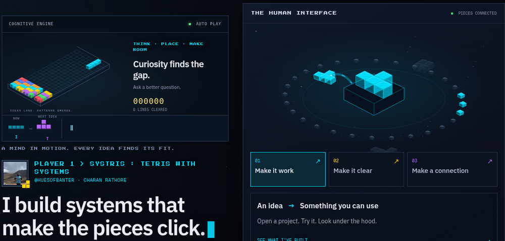

  
   
  

## hey, I'm Charan

I care about two things that sound different but feel the same to me:

1. **what a product is actually doing** when a user clicks something  
2. **what a system is actually doing** in the two seconds before the answer shows up

Most tutorials show you how to call an API. I want to know why the pipeline failed, which layer lied, and whether the feature was the right thing to ship.

I am an **Analyst at MiQ, working across the MENA markets**. Previously, at Flipkart, I worked on seller funnel analytics and search personalization — behavioral data into product decisions. Outside work I build and test intelligent systems: retrieval, memory, forecasts and source-aware agents.

---

## currently

**MiQ · Analyst · MENA markets** 
[Explore my Systris portfolio →](https://charan-tetris-portfolio.vercel.app/)

AI systems · retrieval · inference  
memory · evaluation · product experiments

  
  
  

---

## open source contributions

*if it isn't merged, it isn't here.*

**[magpie](https://github.com/yetone/magpie)** · every agent's model, one place - Codex on DeepSeek, Claude Code on Kimi, from the menu bar

I fixed the Codex prompt cache so two accounts saving in the same mtime tick both keep their instructions. [merged in yetone/magpie#74 →](https://github.com/yetone/magpie/pull/74) · Sep 2026

I stopped disabled keys from being fetched during model refresh, with a regression test proving zero requests to them. [merged in yetone/magpie#76 →](https://github.com/yetone/magpie/pull/76) · Sep 2026

I fixed the `TestSmartRouting` hour-boundary flake by anchoring its reset fixture within one hour, so the five-hour tie-breaker stays deterministic. [merged in yetone/magpie#77 →](https://github.com/yetone/magpie/pull/77) · Sep 2026

I stopped a reply translated from a dying gateway stream from reading as complete, so a dead upstream can't pass a cut-off answer off as finished. [merged in yetone/magpie#78 →](https://github.com/yetone/magpie/pull/78) · Sep 2026

I made the long-turn router count providers hidden from the model picker, so a growing turn no longer stays pinned to the small model. [merged in yetone/magpie#86 →](https://github.com/yetone/magpie/pull/86) · Sep 2026

I stopped group images from being retried on text-only fallbacks, so a vision failure skips them instead of mangling the picture into text. [merged in yetone/magpie#87 →](https://github.com/yetone/magpie/pull/87) · Sep 2026

I fixed usage accounting for SSE events split across data lines or missing a trailing newline, so streamed token counts stop vanishing. [merged in yetone/magpie#94 →](https://github.com/yetone/magpie/pull/94) · Sep 2026

I made Gemini PDFs and audio survive text-only routes, so Magpie no longer treats every file part as an image. [merged in yetone/magpie#95 →](https://github.com/yetone/magpie/pull/95) · Sep 2026

I stopped Gemini ANY mode and Responses allowed_tools from leaking the full tool list, so an allowed subset stays a subset. [merged in yetone/magpie#164 →](https://github.com/yetone/magpie/pull/164) · Sep 2026

I gave Gemini's session-affinity fallback a hash of the conversation to stick to, so keyless requests stop scattering across upstreams. [merged in yetone/magpie#165 →](https://github.com/yetone/magpie/pull/165) · Sep 2026

I cleared the 400 on Responses images referenced by file_id, so stored images survive translation to Chat routes. [merged in yetone/magpie#166 →](https://github.com/yetone/magpie/pull/166) · Sep 2026

I made Gemini VALIDATED mode filter declarations down to the allowed list on translated routes, so the model only sees tools it may call. [merged in yetone/magpie#170 →](https://github.com/yetone/magpie/pull/170) · Sep 2026

I kept Gemini session affinity when the first turn omits its role, treating it as the user turn Gemini says it is. [merged in yetone/magpie#171 →](https://github.com/yetone/magpie/pull/171) · Sep 2026

**[typesafe-computer-use](https://github.com/awlevin/typesafe-computer-use)** · browser agents should read the page, not just the buttons

I gave the browser loop the visible text it was missing, so Jev can see a price or error before calling the job done. [merged in awlevin/typesafe-computer-use#23 →](https://github.com/awlevin/typesafe-computer-use/pull/23) · Sep 2026

---

## the scenic route to main

I stopped Hermes compression from copying long user messages into summaries; the maintainer carried my fix into the merged PR, with credit in its history. [merged via NousResearch/hermes-agent#124966 →](https://github.com/NousResearch/hermes-agent/pull/124966) · Sep 2026

I traced why Anthropic tool_result images died with a 400 on Chat translation; the maintainer shipped his own version of the fix in v0.1.348, crediting the find in the commit message. [fixed via yetone/magpie@504b470 →](https://github.com/yetone/magpie/commit/504b470f127c05a805093ada144e11b58376ddb0) · Sep 2026

I made unanswered user text survive the next turn's persist override; after my PR was closed unmerged, the maintainer carried all four of my commits to main with authorship intact. [merged via NousResearch/hermes-agent#126615 →](https://github.com/NousResearch/hermes-agent/pull/126615) · Sep 2026

---

## what I'm curious about

**01** Where does the latency actually go?  
**02** What should an AI system remember - and prove it remembered from the source?  
**03** When is a forecast wrong because of the model, and when because of the place?  
**04** Why do technically good products still fail distribution?  
**05** Which problems are worth automating, and which only look that way?

---

## things I've built

**[IntelliRAG](https://github.com/charan-rathore/IntelliRAG)**  
*I wanted to know where RAG actually breaks.*

ingestion → chunking → hybrid retrieval → rerank → citations → evaluation → observability  
The live browser lab exposes issue ingestion, cited retrieval traces and a lexical knowledge graph. The public demo currently uses temporary keyword/extractive mode; persistent hybrid retrieval and real-provider evaluation are next. The Python platform has separate deterministic CI benchmarks.

[try the live lab →](https://intellirag-live-own-track.vercel.app/) · [read the measured audit →](https://github.com/charan-rathore/IntelliRAG/blob/main/audit/REPORT.md)

**[memoRABLE](https://github.com/charan-rathore/memoRABLE)**  
*What if documents became memory?*

Six source-linked blocks. Click a memory, the original lines light up. Publish once to email / web / doc without rewriting the truth. Local-first.

[try it →](https://memo-rable.vercel.app)

**[ThermoSense](https://github.com/charan-rathore/Time-Series-Temperature-Modelling)** · hyperlocal temperature forecasting  
*Can a forecast know your rooftop?*

Ground truth → commercial API bias → ensemble forecast → public leaderboard → retrain. The product is the loop, not the model name.

[see the experiment →](https://thermosense-black.vercel.app)

**[Finsight](https://github.com/charan-rathore/agentic-finance-advisor)**  
*Can an AI answer also explain how much it should be trusted?*

Multi-agent research with freshness, source agreement, versioned knowledge, and a confidence score you can inspect.

[inspect the system →](https://github.com/charan-rathore/agentic-finance-advisor)

**[infer-tab](https://github.com/charan-rathore/infer-tab)**  
*What changes between prefill and decode?*

CPU-only KV-cache experiments write traces of attention arithmetic and tensor bytes; a Next.js visualizer replays them. No model download needed.

[run the experiments →](https://github.com/charan-rathore/infer-tab#quick-start)

---

## receipts

| Work | One thing you can check |
| --- | --- |
| [IntelliRAG](https://github.com/charan-rathore/IntelliRAG) | 31 live browser questions in the [audit](https://github.com/charan-rathore/IntelliRAG/blob/main/audit/REPORT.md); RAGAS-style rubric, not an official RAGAS score. |
| [memoRABLE](https://github.com/charan-rathore/memoRABLE) | Six source-linked memory blocks with click-through to the original lines. |
| [ThermoSense](https://github.com/charan-rathore/Time-Series-Temperature-Modelling) | Live dashboard and a public forecast leaderboard. |
| [infer-tab](https://github.com/charan-rathore/infer-tab) | CPU-only KV-cache / prefill-decode traces, replayed in a Next.js visualizer. |
| [magpie](https://github.com/yetone/magpie) | Thirteen merged PRs: [#74](https://github.com/yetone/magpie/pull/74), [#76](https://github.com/yetone/magpie/pull/76), [#77](https://github.com/yetone/magpie/pull/77), [#78](https://github.com/yetone/magpie/pull/78), [#86](https://github.com/yetone/magpie/pull/86), [#87](https://github.com/yetone/magpie/pull/87), [#94](https://github.com/yetone/magpie/pull/94), [#95](https://github.com/yetone/magpie/pull/95), [#164](https://github.com/yetone/magpie/pull/164), [#165](https://github.com/yetone/magpie/pull/165), [#166](https://github.com/yetone/magpie/pull/166), [#170](https://github.com/yetone/magpie/pull/170), [#171](https://github.com/yetone/magpie/pull/171). |
| [openmuse](https://github.com/CopilotKit/openmuse) | [#45](https://github.com/CopilotKit/openmuse/pull/45) fixes duplicate artifacts on interrupted file steps - open, awaiting merge. |

---

## product things I keep taking apart

**Search** - what actually happens between a query and the ranked result (Flipkart search personalization was the first place this got real for me)  
**Funnels** - where discovery leaks: the step users drop, not the dashboard average  
**Trust UX** - when a product should show confidence, provenance, or “I don’t know yet”  
**Distribution** - why a technically solid system still fails to get used  
**The invisible middle** - [the 2 seconds you never see](https://charanrathore.substack.com/p/the-2-seconds-you-never-see): auth, memory, routing, the work that makes complexity feel effortless

I go system → product → business. Same habit: open the black box, name the failure mode, then decide what to ship.

---

## one thing I wrote

**[The 2 seconds you never see](https://charanrathore.substack.com/p/the-2-seconds-you-never-see)**  
I thought I knew what happened after you hit enter. I was wrong.

More when I have something worth saying → [Substack](https://charanrathore.substack.com)

---

## how I work

measure → build → break → learn → repeat

Write the tradeoff down. Keep eval next to the code. Prefer systems that fail in known ways. Same rule for product: if I can’t explain the funnel step, I don’t trust the feature yet.

---

## currently investigating

→ what actually determines RAG latency (retrieval vs rerank vs generation vs cold start)  
→ how memory systems should preserve provenance without becoming another summary blob  
→ when local inference is the right constraint vs when it just feels pure  
→ closed-loop evaluation: leaderboards that force the model to face ground truth  
→ why technically good products fail distribution

*I update this when the questions change.*

---

  <a href="https://github.com/charan-rathore">GitHub</a>
  ·
  <a href="https://charanrathore.substack.com">Substack</a>
  ·
  <a href="https://charan-tetris-portfolio.vercel.app/">Portfolio</a>
  ·
  <a href="mailto:ra7hore.charan@gmail.com">Email</a>

BITS Pilani · dual degree · class of 2026 · MiQ analyst, MENA · ex-Flipkart product analytics 
Older experiments stay public. The four above are the ones that still feel like me.
